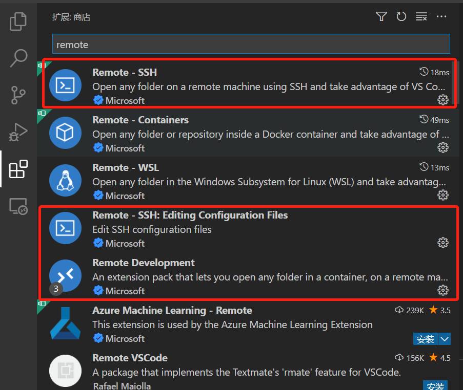
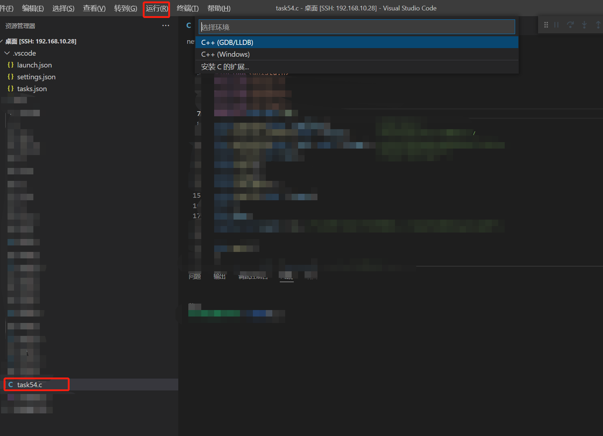

# **配置VScode通过ssh连接到linux主机c调试**

### 一、下载相应扩展

> 首先，在vscode扩展中搜索remote，下载Remote-SSH、Remote-SSH：Editing Configuration Files、Remote Development

**<u><mark>注意，扩展下载后需要重启vscode，扩展才能生效</mark></u>**

### 二、添加主机并连接

> 点击“远程资源管理器”，打开SSH TARGERS窗口，点击右上角‘+’号，在弹出的提示框中输入`ssh + linux主机的ip地址`，即可完成添加，右击创建好的ip，单击`Connect to host`即可完成连接。
> 
> （linux主机启用SSH连接，请参考[linux启用SSH连接](./20220414-01.md)）

### 三、调试

> 连接到SSH后，在资源管理器中选中要运行的C/CPP文件，点击运行--调试，弹出窗口选择C++（GDB/LLDB）---LINUX即可完成调试。**如需要分步调试，可通过添加断点实现。**

通过以上步骤，就可以远程调试C程序啦！