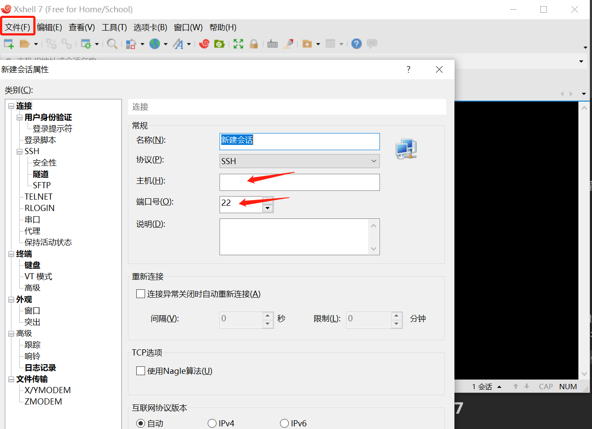
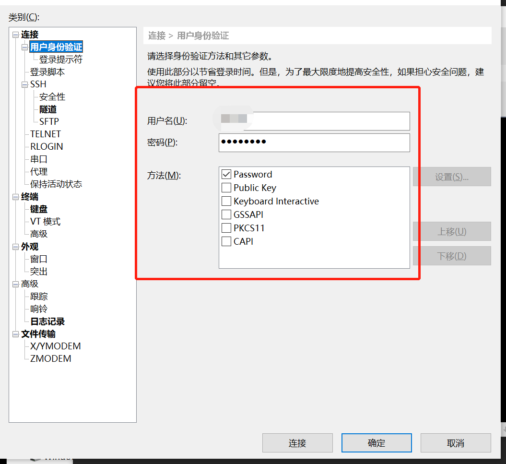

# **linux启用SSH连接**

### 1、更新源列表（此步可省略）

打开"终端窗口"，输入"`sudo apt-get update`"-->回车-->"输入当前登录用户的管理员密码"-->回车,就可以了。

### 2、安装openssh-server

在终端中输入: `sudo apt-get install openssh-server`

### 3、查看ssh服务是否启动

打开"终端窗口"，输入"`sudo ps -e |grep ssh`"，若显示的进程中有sshd,说明ssh服务已经启动，如果没有启动，输入"`sudo service ssh start`"-->回车-->ssh服务就会启动。

若重启后ssh服务未自动启动，可在终端输入`chkconfig sshd on`设置开机自动启动。

## **SSH连接软件-Xshell7**

下载地址：点击右侧链接申请教育版，可免费使用<u>[点击此处下载](https://www.xshell.com/zh/free-for-home-school/)</u>

- xshell创建会话窗口

> ssh默认端口为22，为方便此处不更改
> 
> 会话名称可随意填写
> 
> 主机处填写**linux主机的ip地址**，如192.168.10.2

- xshell7设置身份验证方式

> 用户名以及密码填写**用于登录linux主机登录的用户名和密码**即可，点击连接即可完成连接

#### **通过ssh连接到linux终端就可以直接进行终端的操作啦！**